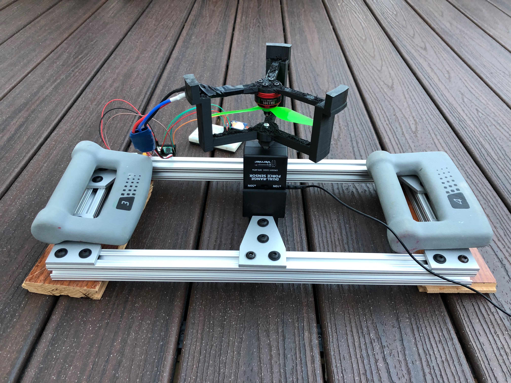

<link rel="stylesheet" href="../../styles/md.css">

shreepa parthaje

<a id="return" href="../../index.html">&#8592; return home</a>

# Ascent - A Vertical-Takeoff Landing Aircraft
## What is it?

  

    Ascent is an aircraft me and two friends designed to stabilize and land itself using only a set of two counter rotating propellers. Our goal was to achieve this using cheap electronics and hardware delivering the whole product for under ~$100. It was largely inspired by the work done with BPS Space's <a href='https://www.youtube.com/watch?v=5kuLr_fbaNs' target="_blank">Sprite aircraft</a>
      
    <u>Our project goals:</u>
    <li>Fly without oscillations</li>
    <li>Hover at 5m</li>
    <li>Land without tipping over</li>
  

  

    
  

## Hardware

  

    
    Frame: Made out of light weight cheap carbon-fiber rods
  

  

    
    Gimballed nozzle: Controls thrust direction
  

  

    
    Flight Computer: Inertial Measurement Unit, Altimeter, Teensy 3.6 Microcontroller, and SD card reader
  

  

    
    Counter-rotating propellers: Creates 2kg of thrust + helps controll roll
  

    

        <video controls="" style="height: 30vh;">
            <source src="../../img/g/ascent/1.mp4#t=0.01" type="video/mp4">
        </video>
         
        Testing the gimbal response speed
    

    

    Test
    

<!-- <pre>
<code>
def method():
    return 4
</code>
</pre> -->

`hello`

## Software + Controls

