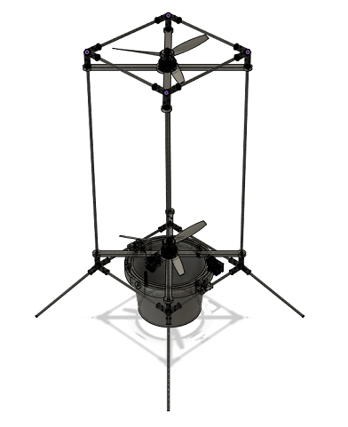
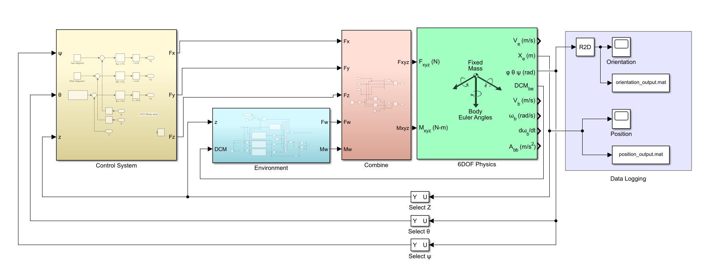
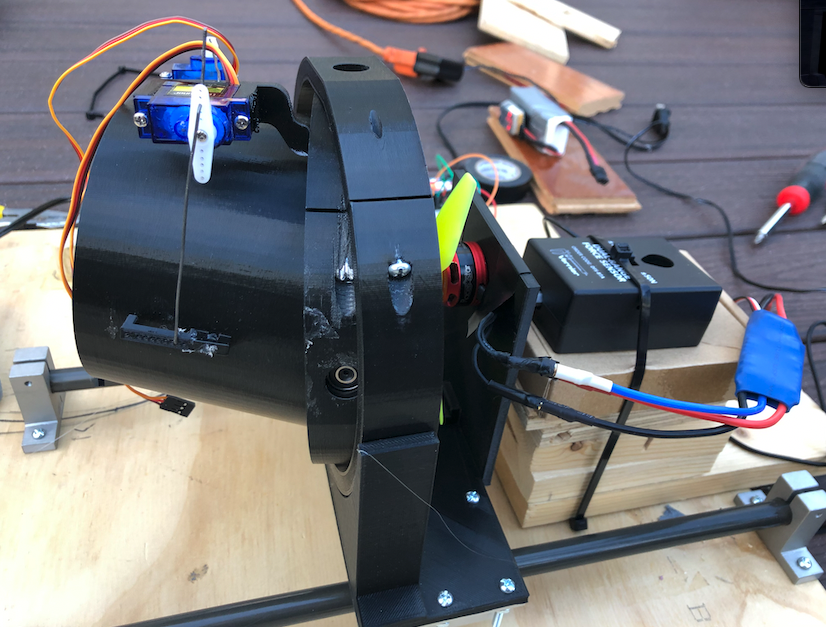

<link rel="stylesheet" href="../../styles/md.css">

shreepa parthaje

<a id="return" href="../../index.html">&#8592; return home</a>

    

# Ascent - A Vertical-Takeoff Landing Aircraft

Jump to: 
Hardware •
Control Systems •
Kalman Filter •
Flight Software •
Gallery

## What is Ascent?

Ascent is an aircraft me and two friends designed to stabilize and land itself using only a set of two counter rotating propellers. Our goal was to achieve this using cheap electronics and hardware delivering the whole product for under ~$100. It was largely inspired by the work done with BPS Space's [Sprite Aircraft](https://www.youtube.com/watch?v=5kuLr_fbaNs).

Project goals:
1. Fly without oscillating
2. Hover at 5m
3. Land without tipping over

<h2 id="hw">Hardware and Electronics</h2>

### Hardware
The two main hardware components we designed were the frame and a gimballed nozzle. The frame had to be light weight and durable, while able to easily carry all the electronics. The gimballed nozzle is crucial for redirecting thrust for thrust vector control.

Servos turn the nozzle to redirect thrust to control aircraft's yaw and pitch. 

### Electronics

The flight computer was made with:

- Teensy 3.6
- BNO055 Inertial Measurement Unit
- BMP388 Altimeter
- SD Card SPI Reader/Writer
- XBee Radio

<h2 id="pid">Control Systems</h2>

The control system's were critical to both stabilize Ascent and control its vertical position. To keep it simple, we decided to use PID loops to control the forces applied on the Ascent craft (treating it like a point mass). When integrating the controller into the flight software, we planned to model the craft with empirical data to take force outputs from the PID loops and convert them into actuation of the servos and ESC. 

<video controls style="width: 60%; margin-left: 20%;">
    <source src="../../img/g/ascent/controls.m4v#t=0.1" type="video/mp4">
     
</video>

There are 3 degrees of freedom (DOF) that the control systems don't account for: `x`, `y`, and `roll`. The system allows for translations in position, and the counter-rotating propellers are designed to passively mitigate roll. 

All of our simulations were done in MATLAB's Simulink. Our Simulink model consisted of four parts:
1. The PID loops
2. The environmental factors
3. The combination block - adds the forces from the PID and environment block, while taking into account the craft's size to calculate moments
4. 6DOF plant - Takes forces in the body frame of reference and applies them to the point mass in the environmental frame of references.

### The PID Loops

The goal of the three PID loops is to output a force in each direction based on `E_ψ`, `E_θ` and `E_z` (error in yaw, pitch, and height based on the setpoint). The yaw and pitch setpoints are set to zero as we want the craft to remain upright during ascent and decent. The height controller gets a variable setpoint corresponding to the craft's desired position during the hop.  

 `S(F)` or `Signal(force)` is a formula created from  experimental data which maps a desired thrust to the digital signal provided to the ESC connected to the brushless motor

Using the `F_x`, `F_y`, and `F_z` PID outputs and plugging in the magnitude into `S(F)`, we figure out what actuation value to provide to the ESC. Inverse trig functions can be used to find the angles to actuate the servos to. 

### The Environment Block

In the environmental block we can push in external forces from wind and gravity primarily to see how to craft behaves in different conditions.

### Results

Position vs Time

Orientation vs Time

In the position graph, the translational drift is apparent (yellow and blue lines); however, it is pretty clear the control systems are able to match the setpoint function for vertical position. It is important to note landing collision dynamics were not modelled, so t > ~8s needs to be ignored in both graphs. 

In the orientation graph, we see the control systems is nearly perfect with the orientation change in both pitch and yaw is less than 0.0025º or (1.389e-5)π rad. It is important to note in this graph to ignore the red (or roll) line as the dynamics for roll were not modelled. 

<h2 id="kf">Navigation with Kalman Filter</h2>

One aspect of this project which was completely new to me was the idea that sensors cannot be trusted with the exact values they report, especially with the drift from the IMU. With our navigation software we wanted to fuse data from the barometer and IMU to get a good estimation of our position. Experimentally, we found the orientation to be passable through the values the BNO055 reported. 

### Simulation

### Validation

This board setup was tied to a pully in order to validate the Kalman filter. The platform was raised and lowered at varying speeds with a ruler in the video frame. The video data was then compared to recorded data on the SD card. 

<h2 id="fsw">Flight Software</h2>

The flight software was written in C++ and built using PlatformIO. The software is split into read, control, and actuate tasks which run in a single threaded loop. The read tasks update data into the state field registry, the control tasks make decisions for the actuation tasks, and the actuation tasks use the hardware to actuate the vehicle (also to send / store data). The tasks communicate through the StateField registry which is a global store of information that gets updated with every loop of the main control loop. 

<h2 id="gallery">Gallery</h2>

First iteration of the gimbal (never went into production)

Second iteration of the gimbal (tough process to assemble)

First iteration of the thrust test stand (failed because some of the force transferred into bending the plastic)

Second iteration of the thrust test stand (made structural improvements to help with bending still had the same fundamental issue)

First iteration of the thrust test stand from another angle

Final iteration of the thrust test stand

