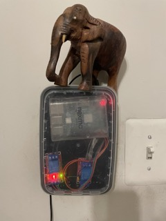
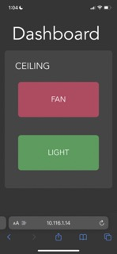
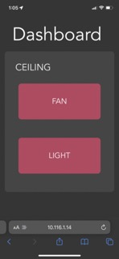
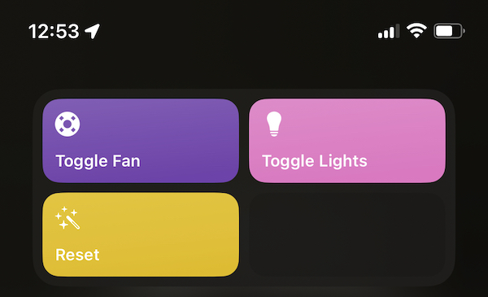
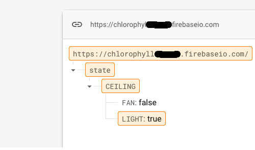

<link rel="stylesheet" href="../../styles/md.css">

shreepa parthaje

<a id="return" href="../../index.html">&#8592; return home</a>

    

# Chlorophyll Smart Home
Chlorophyll was an expandable system I developed, so I could convert standard electrical switches in my home into "smart" units.

## Demo

<video controls="" style="width: 60%; margin-left: 20%;">
    <source src="../../img/g/chlorophyll/demo.m4v" type="video/mp4">
</video>

## Software Components
- `Firebase` - Storage of system's state, any update to database results in all subscribers getting notified
- `chloroplast` - Python software which runs on the hardware and handles notifications from Firebase
- `Solar` - Vue.js website which runs on local network and acts as a virtual switch, updates Firebase database to change system state
- `iOS Shortcut` - Runs Python script to make updates to Firebase database to change system state
  - `Siri` activation for iOS shortcut

## Hardware
The circuitry for the project was relatively simple. I removed the switch from the wall and put a relay in between where the switch was. The wires enter the normally open pin and exit on the common pin, so when the signal voltage is `HIGH` the circuit closes, providing power to the light/fan.

## Expandability 
The hardware was relatively cheap compared to smart home alternatives on the market, as it could work with the Raspberry Pi Zero W and extremely cheap relay switches. This allowed me to design the project with expandability in mind. Each Rpi + relay(s) unit is named: `chlorophyll-node-n` where n represents the node's number. Each node runs the same `chloroplast` software, and based on the Firebase notifications it handles updating the relevant GPIO pin. The website was also designed to expand easily where each node has a section in gray with relevant switches. 

## Gallery

Raspberry Pi 3b with GPIO pins connected to relevant relays. 

Switches accessible via a website on our home's network. The switches update when the firebase datastore is changed (keeping the website in sync with the current state).

iOS Shortcuts

System state stored in Firebase Realtime database

