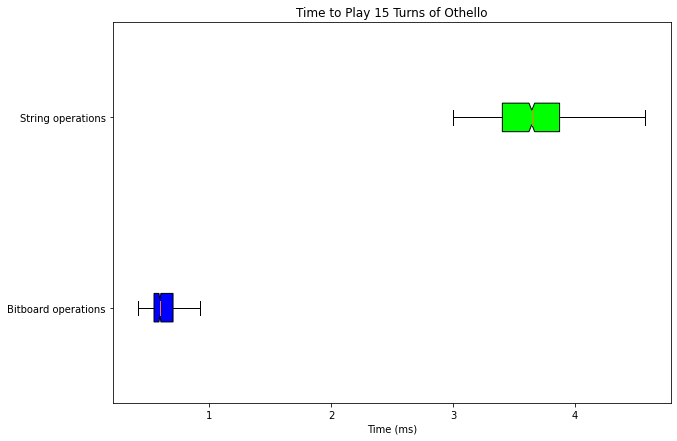

<link rel="stylesheet" href="../../styles/md.css">

shreepa parthaje

<a id="return" href="../../index.html">&#8592; return home</a>

    

# Othello AI

[Othello](https://en.wikipedia.org/wiki/Reversi) (also called Reversi) is a simple board game where there are two players white (`x`) and black (`o`). The goal of the game is to maximize the number of pieces you have on the board. The moves are similar to captures in checkers, but instead of removing the piece you jump over the piece gets flipped to your color. There is also no limits to how many pieces can be jumped over. 

Designing an AI for this game is an interesting problem because the captures create interesting edge cases on which pieces get flipped. This can make finding moves and playing moves with string operations costly. 

### Bitboards
That's where bitboards come in. For this project I wanted to implement bitboards (inspired by https://www.chessprogramming.org/Bitboards). Bitboards store the game as two 64 bit numbers. In the `x` bitboard, the 1s represent an `x` piece and the 0s represent either an empty space or an `o` and vice versa for the `o` bitboard. 

By using masks and shifts in a process called flooding, all game state calculations can be achieved using `O(1)` bitwise / logic operations. 

### How much better are bitboards?

I wrote algorithms to find moves and play moves using a string representation of the game state and a bitboard representation of the game state to generate the two box plots above. It is clear even when excluding outliers the median 15 turn game is more time intensive when using a string representation. When accounting for certain game paths as outliers, the string representation is ridiculously slow, taking `~10 ms` extra on my computer's CPU. 

When using a standard minimax tree with alpha beta pruning there are multiple game paths which need to be explored in order to make a decent decision. At a certain depth, exploration is cut off to use a heuristic to determine if the game state is "winning." Because bitboards creates massive speed improvements, it allows minimax to explore deeper in the same amount of time thereby improving the quality in decisions making. 

# Bitboard algorithm walk through

[Jupyter Notebook Source](https://sparthaje.github.io/othello.ipynb)
