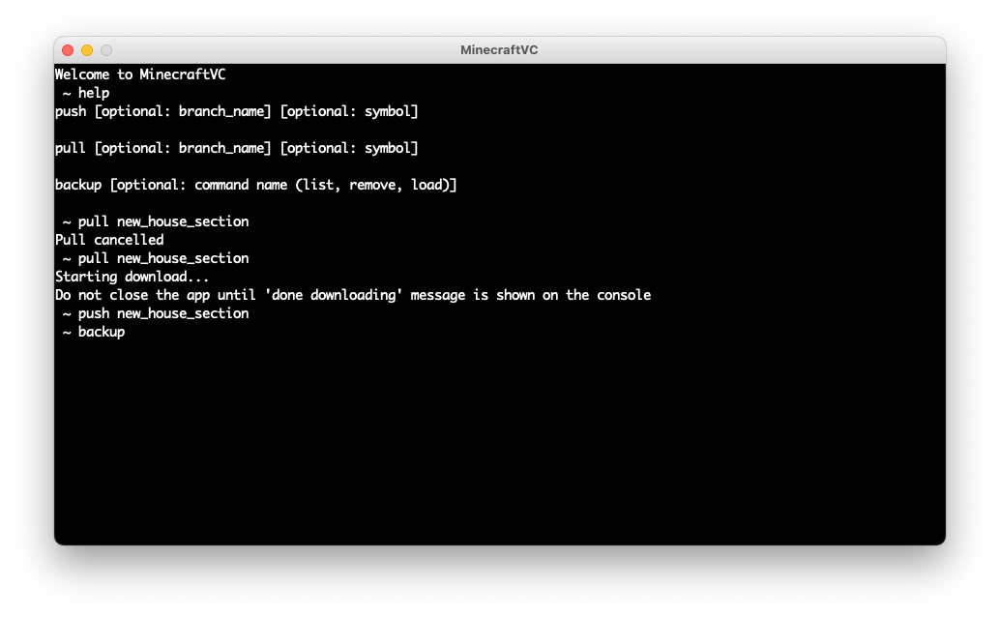

<link rel="stylesheet" href="../../styles/md.css">

shreepa parthaje

<a id="return" href="../../index.html">&#8592; return home</a>

    

# Other Projects

Jump to: 
Ping Pong Ball Launcher •
Gravity Battery •
Minecraft Version Control

<h2 id="ball">Ping Pong Ball Launcher</h2>

<video controls="" style="width: 60%;">
    <source src="../../img/g/other/pingpongball.mp4" type="video/mp4">
</video>

Launcher I made with a friend that uses two DC motors and wheels to launch ping pong balls.

<h2 id="gb">Gravity Battery</h2>

In my first year engineering class we built a battery that stores energy using gravitational potential energy. I designed and built the circuitry that allows one motor to be used as both a motor and generator. 

<h2 id="mcvc">Minecraft Version Control</h2>

I wanted to be able to sync my Minecraft worlds between two computers. This way I could play at on the bus without internet, and then see the changes on my computer at home after syncing. I built MinecraftVC using Dropbox's API to use a Git-like command interface (push, pull, and branch). 

[MinecraftVC Source](https://github.com/sparthaje/MinecraftVC)

